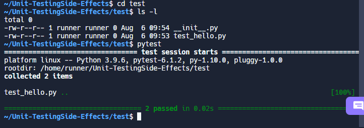

## How to organize unit testing in python

## Preparing functions with side effecgts for unit testing


Organize the functions with side effects to return a value and handle the rest in the main function such as:
```
def hello(to="world"):
    return f"Hello, {to}"
```

## Organize the unit test

```
mkdir test
touch test/test_hello.py
touch test/__init__.py
```

Then run pytest:
`pytest`


